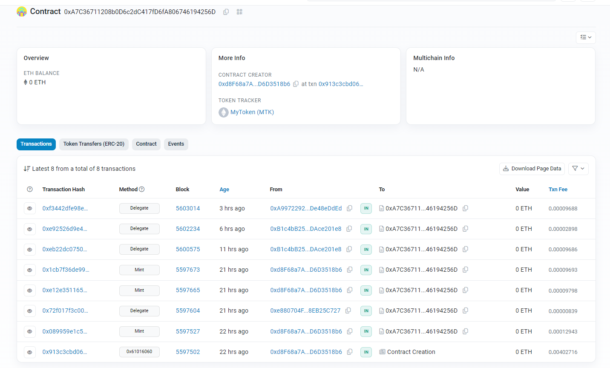
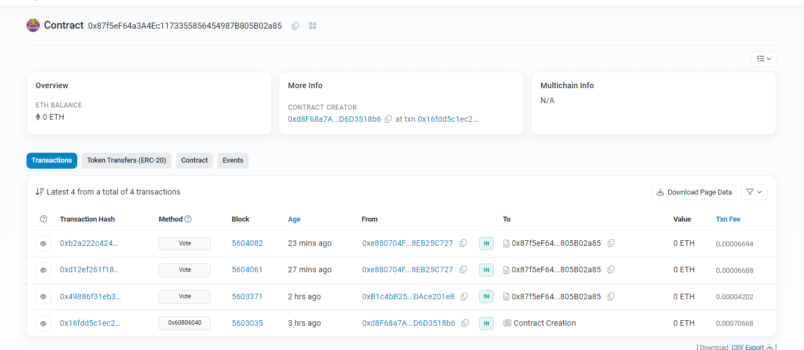

# Tokenized Ballot 


## Summary

Project comprises two contracts: `MyToken` and `TokenizedBallot`, which together form the backbone of a decentralized governance system utilizing token-based voting.

1. **MyToken Contract**: This contract implements a custom token called `MyToken` utilizing OpenZeppelin's ERC20 standard along with extensions for permit and voting capabilities. The contract also integrates AccessControl to manage roles. It has the following key functionalities:
   - Initialization of the token with the name "MyToken" and symbol "MTK".
   - Definition of a constant role `MINTER_ROLE` for minting tokens.
   - Granting of roles (`DEFAULT_ADMIN_ROLE` and `MINTER_ROLE`) to the contract deployer.
   - Implementation of a `mint` function allowing the designated minter to mint tokens to specified addresses.
2. **TokenizedBallot Contract**: This contract represents a ballot system where users can vote on different proposals using tokens from the `MyToken` contract. Key features of this contract include:
   - A struct `Proposal` to define each proposal's name and corresponding vote count.
   - Initialization with an array of proposal names, the address of the `MyToken` contract, and a target block number.
   - A `vote` function enabling users to cast votes for a specific proposal by spending their voting power.
   - Calculation of the winning proposal based on the highest vote count.
   - Public functions `winningProposal` and `winnerName` to retrieve the winning proposal's index and name, respectively.

The `TokenizedBallot` contract facilitates decentralized decision-making by allowing token holders to vote on proposals, ultimately determining the direction of the project. Users can delegate their voting power and participate in the governance process in a transparent and tamper-resistant manner, thanks to blockchain technology and smart contracts.

This system ensures that decisions are made collaboratively within the community, aligning with the principles of decentralization and democratization.


## Demo 


### Wallets and Contracts used:

```typescript
  const tokenContractAddress = "0xA7C36711208b0D6c2dC417fD6fA806746194256D";
  const tokenizedBallotContractAddress =
    "0x87f5eF64a3A4Ec1173355856454987B805B02a85"; // group 1
  // "0xd95fdfe538f0ce7d3e8cb7a16af7af1cd9e60ebd"; // Initial Test1
  const aaronAddress = "0xA9972292A1B7c82d191E79f34D7A493De48eDdEd";
  const joeBorAddress = "0xB1c4bB25346ad3F3de0019AE75eEa1ADAce201e8";

acc2 0xe880704FA2edd72Ff0F3aE5CdEC559c8EB25C727
Deployer account - 0xd8F68a7AeB7df4c349274e84B493451D6D3518b6
```


### Token contract

https://sepolia.etherscan.io/address/0xA7C36711208b0D6c2dC417fD6fA806746194256D

[MyToken.sol](https://github.com/rchak007/TokenizedBallot/blob/master/contracts/MyToken.sol)


#### Mint and delegate

Below shows initial deployer `0xd8F68a7AeB7df4c349274e84B493451D6D3518b6` created token contract and mints tokens to 3 different accounts which later self-delegate.





### Tokenized Ballot

https://sepolia.etherscan.io/address/0x87f5eF64a3A4Ec1173355856454987B805B02a85


[TokenizedBallot.sol](https://github.com/rchak007/TokenizedBallot/blob/master/contracts/TokenizedBallot.sol)


2 addresses Votes.

one of them voted twice in different amounts.

#### Vote

Lets anyone who already delegated the tokens to be able vote on any of the proposals available to vote on.




### Scripts

Typescript scripts using Viem and Hardhat were used to interact with Sepolia testnet.


#### Read States


[Script for Read States](https://github.com/rchak007/TokenizedBallot/blob/master/scripts/ReadStates.ts)

- This scripts lists contract addresses for the Tokenized Ballot and Token contract
- targetBlockNumber used beyond which Tokens delegated after that cannot be used in the voting
- Lists the proposals on this Ballot
- Current Winner
- Lists the VoteSpent by address - since its mapping for now only known address are voted but these can eventually be picked up from blockchain ledger to know all that interacted with token.

```bash
TokenizedBallot> npx hardhat run .\scripts\ReadStates.ts
Tokenized Ballot Contract 0x87f5eF64a3A4Ec1173355856454987B805B02a85 is using Token contract -  0xA7C36711208b0D6c2dC417fD6fA806746194256D 

Tokenized Contract 0x87f5eF64a3A4Ec1173355856454987B805B02a85 has Block Number -  5603034 

Proposal  0n  =  Defi
Proposal  1n  =  Gaming
Proposal  2n  =  DePin


Winning name =  DePin
Votespent by acc2 0xe880704FA2edd72Ff0F3aE5CdEC559c8EB25C727, Votespent =  5000000000000000001
Votespent by Joe's account 0xB1c4bB25346ad3F3de0019AE75eEa1ADAce201e8, Votespent =  2000000000000000000
```


#### Deploy Token Contract & Mint

[Script for Deploy Token Contract](https://github.com/rchak007/TokenizedBallot/blob/master/scripts/DeployTokenContractMintViem.ts)

- This basically deploys the Token contract
- Mints to other addresses


#### Deploy Tokenized Ballot


[Script for Deploying Tokenized Ballot](https://github.com/rchak007/TokenizedBallot/blob/master/scripts/DeployTokenizedBallotContractViem.ts)

- We wait for Tokens to be with addresses and also delegate - only those delegated prior to Deploying Ballot can participate. this is avoid deliberate minting later to influence voting.
- Script using Viem to deploy contract


#### Check Voting power at Address


[Script to check voting power](https://github.com/rchak007/TokenizedBallot/blob/master/scripts/ReadVotingPower.ts)

- before voting addreses can check their Voting power. this shows what's already been delegated to vote.


#### Self Delegate 

[Script to self delegate](https://github.com/rchak007/TokenizedBallot/blob/master/scripts/SelfDelegate.ts)

- once the owners have the tokens minted to their account they can delegate these.


#### Vote

[Script to Vote](https://github.com/rchak007/TokenizedBallot/blob/master/scripts/Vote.ts)

- most importantly to vote for proposal. They can choose what amount to vote for which proposal.


